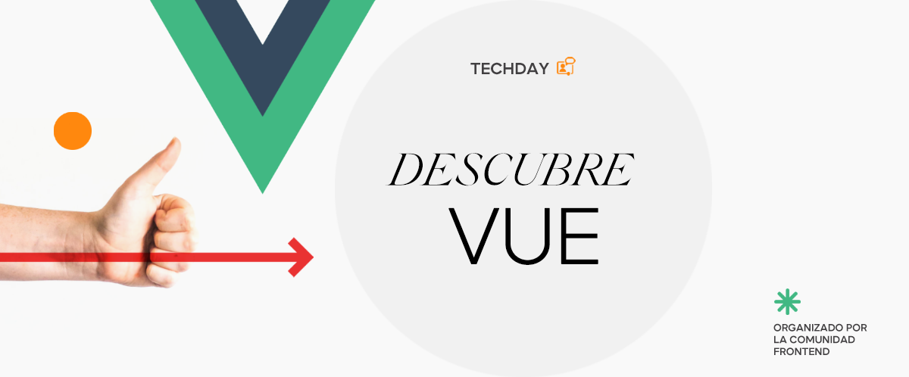
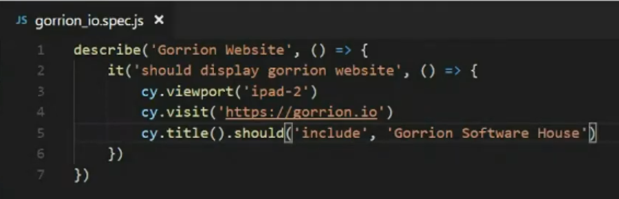
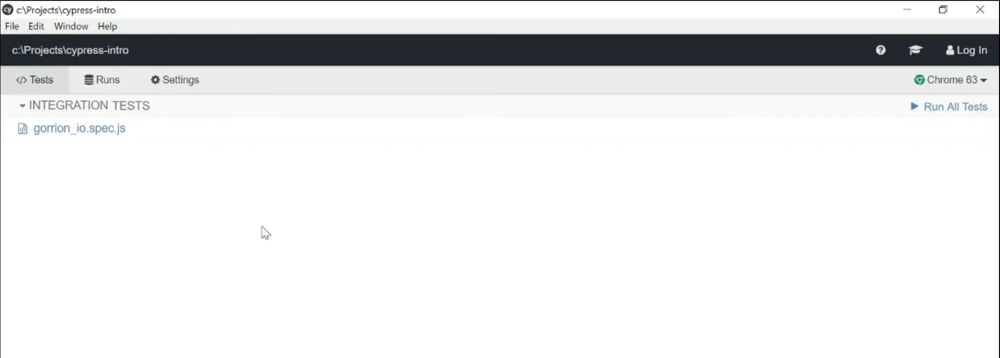
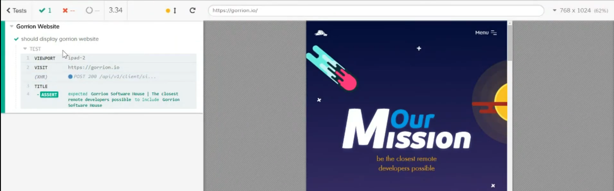
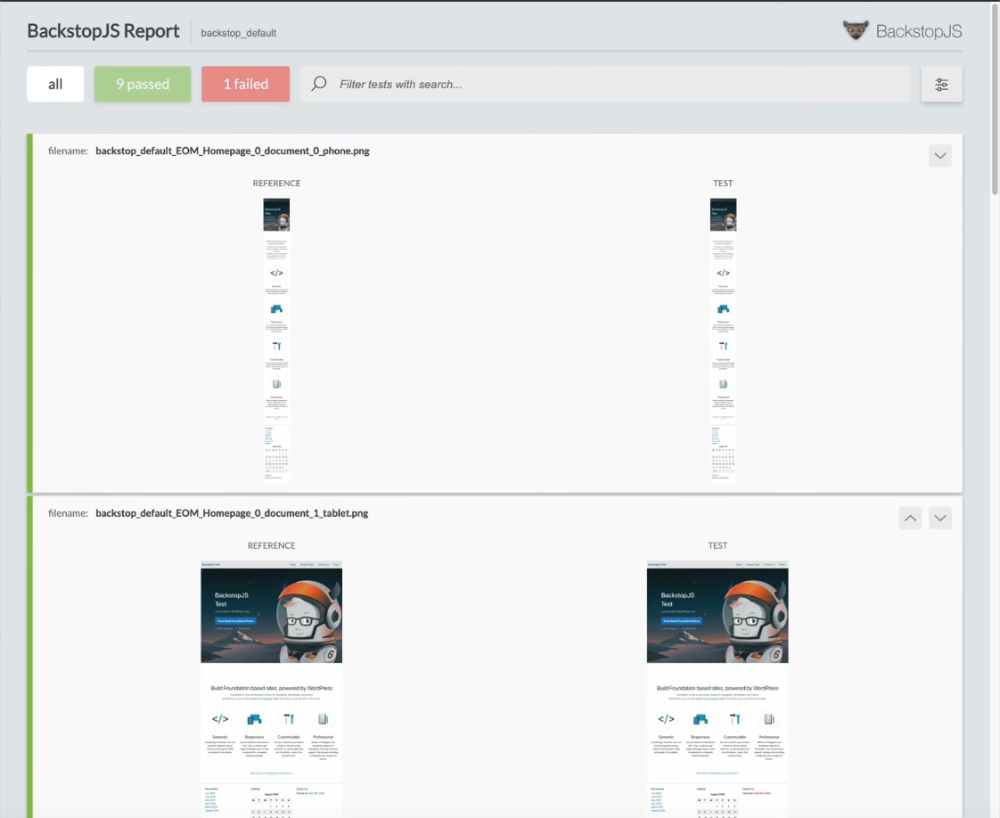
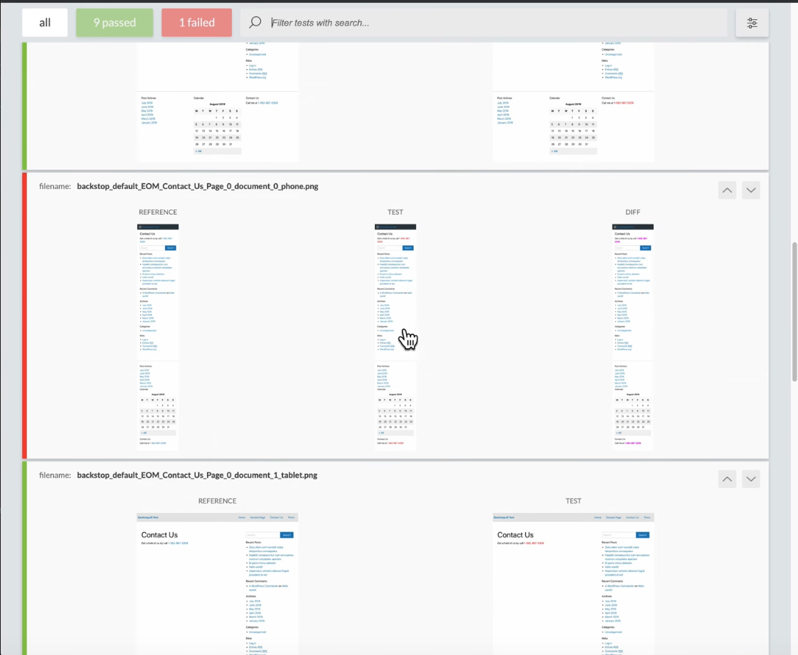
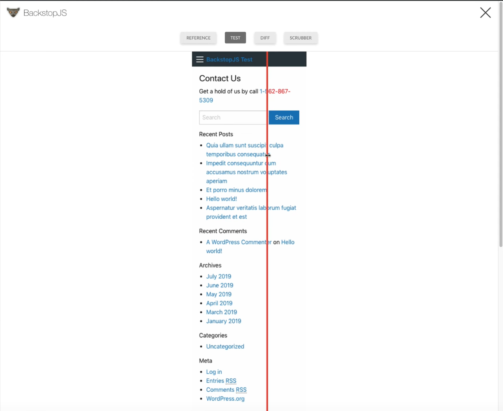
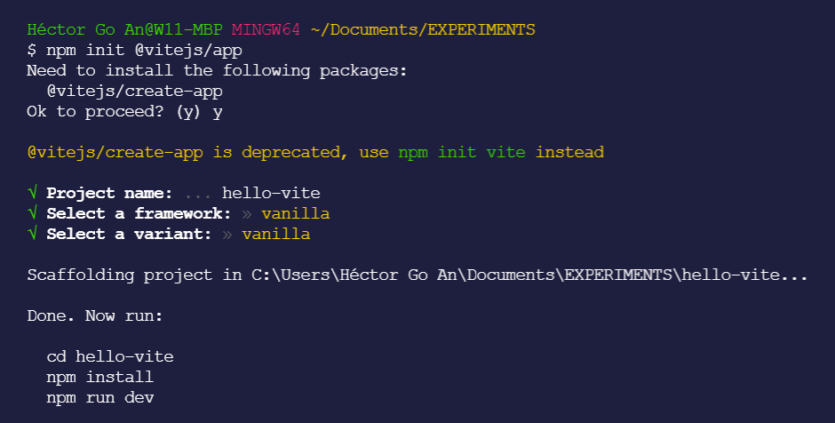
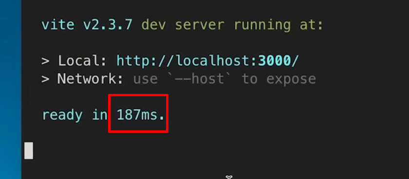

---

---

<!-- _class: lead -->

# Cerrando el círculo - "State of the art"

---

<!-- _class: lead -->

# 1. Testing en Vue

# 2. Nuxt

# 3. Vite

---

<!-- _class: lead -->

# 1. Testing en Vue

--

#### Tipos de tests

#### Estándares en Vue

---

<!-- _class: lead -->

# Tipos de tests

-   Tests unitarios / componentes
-   Test de integración
-   Tests E2E (end to end) / funcionales
-   Visual testing

---

# Tests unitarios

-   Cada unidad elemental testeable del proyecto se somete a pruebas
-   Objetivo: Aislar código, probarlo y determinar que funciona cómo se intencionó que lo hiciera
-   Librería estándar en Vue:
    -   Vue testing libary

---

# Tests de integración

-   Los módulos individuales se combinan y testean en grupo
-   Objetivo: Evaluar si la aplicación cumple los requisitos funcionales
-   Los test de integración toman de entrada módulos que han pasado test unitarios, los agrega y les ejecuta los test definidos para el agregado
-   Librería estándar en Vue:
    -   Vue testing library

---

<!-- _class: lead -->

# Vue Testing library

-   Conjunto de librerías y frameworks bajo una capa de abstracción que expone una API y una filosofía
-   Orientado a Vue
-   Basado en DOM testing library, Vue Test Utils y Jest

---

# Tests E2E / Test funcionales

-   La aplicación se testea entera desde el punto de vista de un usuario real
-   Objetivo: Cobertura de partes que las pruebas unitarias y las pruebas de integración no cubren
-   Se suele emplear un robot que "utiliza" la app y verifica que todo funciona correctamente
-   Librería estándar en Vue:
    -   Cypress

---

<!-- _class: lead -->

# Cypress

-   Escribimos test que se ejecutan en una ventana del navegador
-   Podemos analizar paso a paso
-   Muy visual

---

# Cypress - Ejemplo

---

# Cypress - Ejemplo

---

# Cypress - Ejemplo

---

# Tests Visuales

-   Modalidad de test paralela al desarrollo y al resto de tests
-   Objetivo: Evaluar la presencia de bugs visuales (distintos a los funcionales)
-   Evalúan el output de la aplicación y lo comparan con lo especificado en su diseño
-   Librería estándar en Vue:
    -   Backstop JS

---

<!-- _class: lead -->

# Backstop JS

-   Útil en escenarios en los que cambiamos algo visual y queremos cerciorarnos de no haber "roto" nada (visualmente)
-   Ej: Cambiamos la propiedad de color de una clase y afectamos a varios elementos. (miles de entradas en un blog)

---

<!-- _class: lead -->

# Backstop JS

-   Lo que hace por debajo es abrir las vistas en varios viewports (dimensiones de dispositivo), hace capturas de pantalla y las compara
-   Al final del proceso nos muestra un reporte con los cambios que detecta entre versiones
-   Podemos especificar el % de cambio

---

---

---

---

<!-- _class: lead -->

# 2. Nuxt.js

###### pron: /nʌkst/

---

<!-- _class: lead -->

# Introducción

-   Framework para crear aplicaciones Vue.js
-   Facilita a los desarrolladores el uso de las últimas tecnologías de una manera sencilla y organizada.
-   Soporte "out of the box":
    -   Server Side Rendering (SSR)
    -   Static Site Generation (pre-rendering)
    -   Meta tags
    -   Code splitting
    -   etc

---

<!-- _class: lead -->

# Server Side Rendering (SSR)

-   Soluciona el problema de tratar con optimización SEO y meta tags
-   Este problema surge porque no tenemos nada de contenido de nuestra app hasta que no se ejecuta js
-   Con SSR: El servidor renderizará (generará el html de respuesta) y lo servirá al cliente o al crawler
-   También mejora rendimiento

---

<!-- _class: lead -->

# Static Sites Generation

-   Pre-rendering
-   Generación de los html previa (renderizado)
-   Beneficios de SSR y hosting gratuito
-   Ideal en aplicaciones con pocas páginas (p.ej una página personal)

---

<!-- _class: lead -->

# Code Splitting

-   Repartición del código js en varios archivos
-   Nuxt creará un archivo .js para cada página
-   Si nuestra app tiene 100 componentes pero la homepage sólo usa 10, en su .js no necesitamos los otros 90
-   Gestión correcta de las dependencias

---

<!-- _class: lead -->

# Conclusión

-   Nuxt nos facilita el uso de estas tecnologías ahorrándonos tiempo de investigación e implementación propia
-   Elimina el riesgo de reinventar la rueda
-   Habilitamos estas tecnologías simplemente activándolas en el archivo de configuración

---

<!-- _class: lead -->

# 3. Vite

###### pron: /vit/

---

<!-- _class: lead -->

-   Conjunto de herramientas de desarrollo y construcción (Build Tool)
-   Compite con webpack
-   Mismo creador que Vue
-   Descrita cómo "Next Generation Frontend Tooling"
-   Nombrado así porque en francés significa "rápido"

---

<!-- _class: lead -->

# Incluye

-   Dev server
-   Herramienta para generar bundles de producción

---

<!-- _class: lead -->

# ¿Qué pretende resolver?

-   El problema de velocidad de feedback en tiempo de desarrollo
-   Vue Cli (con webpack), en proyectos grandes puede llegar a tardar hasta un minuto en "refrescar".
-   Esto se produce por la necesidar de hacer bundles de código, problema que se arrastra desde antes de la existencia de soporte de los ESModules en los navegadores
-   Si eliminamos el empaquetamiento de estos bundles y aprovechamos el soporte de los ESModules, ganaremos velocidad

---

<!-- _class: lead -->

# Además...

-   Agnóstico de framework
-   Introduce una nueva forma de gestionar dependencias, llegando incluso a hacer pre-bundles de dependencias pesadas para reducir llamadas http
-   Dentro de un proyecto vite puedes enlazar a archivos .ts directamente y Vite los transpila automáticamente(usando ESBuild) (sin type-checking)

---

<!-- _class: lead -->

-   Cómo ESBuild está escrito en GoLang, es 30x transpilando Ts que si lo haces con Ts...
-   Se toma la decisión técnica de que el aumento de rendimiento merece la pena y se delega el chequeo de tipados en el programador, vía la ayuda de tsconfig en el IDE.

---

<!-- _class: lead -->

-   npm init @vitejs/app
-   En el paso de selección de framework podremos elegir entre varios de ellos, y sus versiones en js o ts

---

---

<!-- _class: lead -->

-   El npm install se ejecuta muy rápido, ya que sólo ha de instalar vite y sus dependencias
-   Pero ... lo mejor es lo que tarda en levantar el servidor

---

---

<!-- _class: lead -->

## 3.1 - Proyectos a partir de Vite

-   Vitest
-   Plugin para módulos federados (vite-plugin-federation)

---

<!-- _class: lead -->

# Vitest

-   Herramienta de testing
-   Destaca por su velocidad
-   Cobertura de varios tipos de test
-   Uso del entorno de desarrollo Vite

---

<!-- _class: lead -->

# vite-plugin-federation

-   Implementación del concepto [módulos federados de webpack](https://webpack.js.org/concepts/module-federation/)
-   Orquestación de micro-frontends (y más)
-   Un proyecto que se compone de varios "builds" independientes entre ellos
